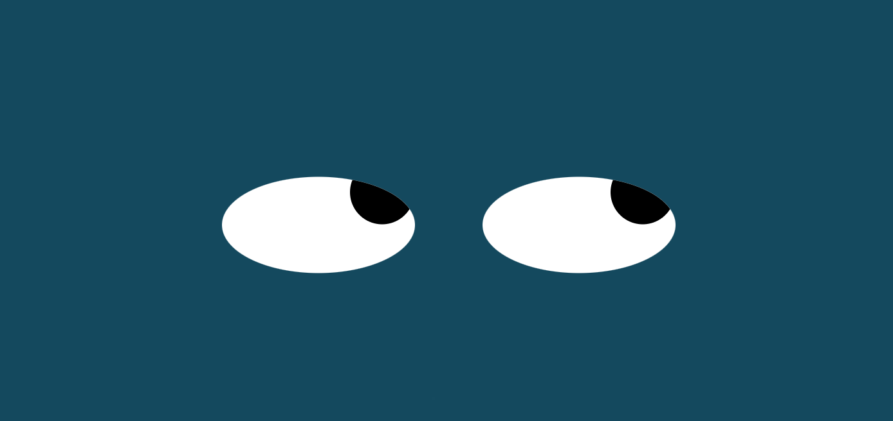

<a href="https://leanneh11.github.io/LeanneH/" >BACK TO PORTFOLIO</a>

# Eyes Exercise

## **Description:**
This is week eight's JavaScript project to create a graphic of a set of eyes on the screen that follow the mouse movement around. This assignment uses HTML, CSS, and JavaScript. xxxxxxxxxxxxxxxxxxxxxxxxxxxxxxxxxxxxxxxxxxxxxxxxxxxxxxxxxx

## **Image:** 
 

## **How to Run the Program:**
First install the files. To install, please download the files to your laptop.  To execute, drag index.html onto your browser's URL window.

## **Roadmap of Future Improvements:**
The plan for improving this program includes the following:
- Enhancing the eyes graphic, for example add eyelashes that move when the eyes blink
- Make the eyes blink, make the eyes cry, add wrinkles or an eye "smile." 

## **Support:**
You may contact me via GitHub or LinkedIn

## **License information:**
MIT License

Copyright (c) 2021 omarqumo23

Permission is hereby granted, free of charge, to any person obtaining a copy
of this software and associated documentation files (the "Software"), to deal
in the Software without restriction, including without limitation the rights
to use, copy, modify, merge, publish, distribute, sublicense, and/or sell
copies of the Software, and to permit persons to whom the Software is
furnished to do so, subject to the following conditions:

The above copyright notice and this permission notice shall be included in all
copies or substantial portions of the Software.

THE SOFTWARE IS PROVIDED "AS IS", WITHOUT WARRANTY OF ANY KIND, EXPRESS OR
IMPLIED, INCLUDING BUT NOT LIMITED TO THE WARRANTIES OF MERCHANTABILITY,
FITNESS FOR A PARTICULAR PURPOSE AND NONINFRINGEMENT. IN NO EVENT SHALL THE
AUTHORS OR COPYRIGHT HOLDERS BE LIABLE FOR ANY CLAIM, DAMAGES OR OTHER
LIABILITY, WHETHER IN AN ACTION OF CONTRACT, TORT OR OTHERWISE, ARISING FROM,
OUT OF OR IN CONNECTION WITH THE SOFTWARE OR THE USE OR OTHER DEALINGS IN THE
SOFTWARE.
 
